Original high resolution images in the [`images`](images) folder.

Below are low resolution (`800px` wide) for faster loading / saving limited mobile data:


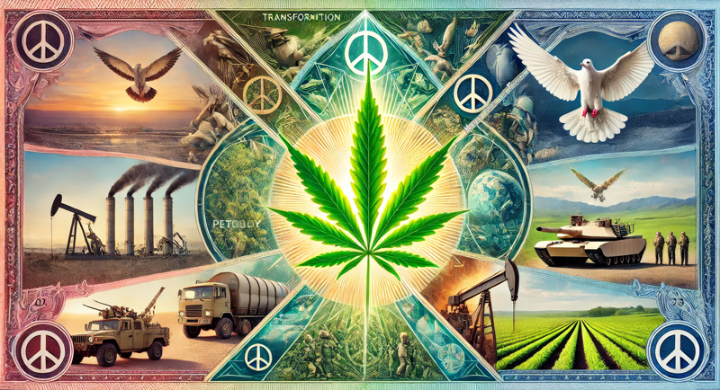
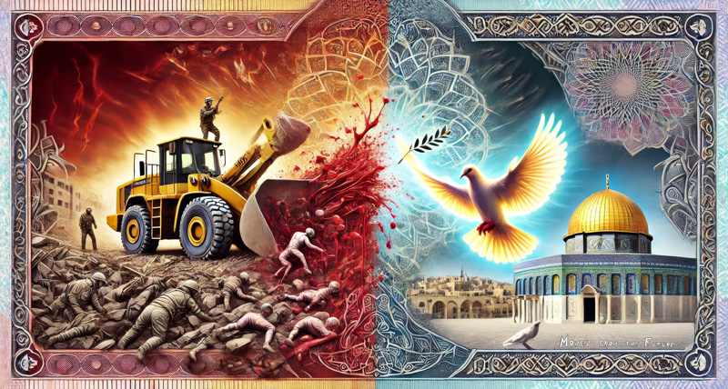
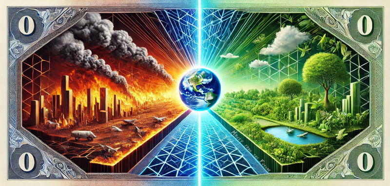
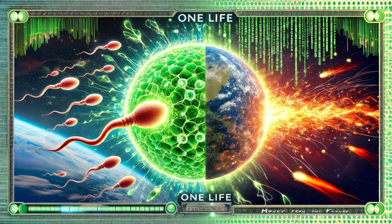
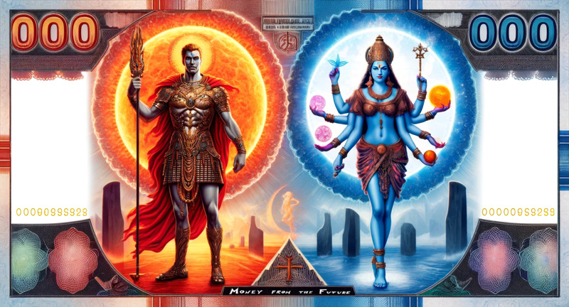
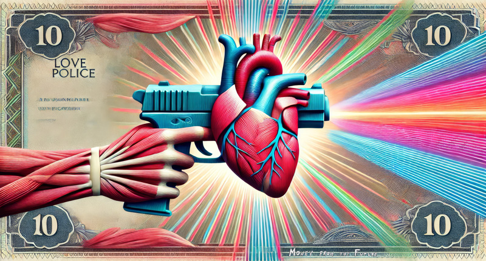
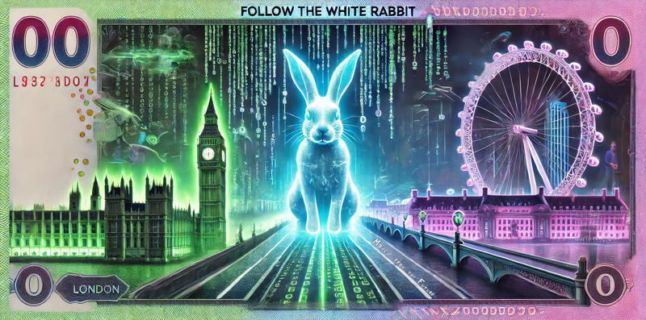
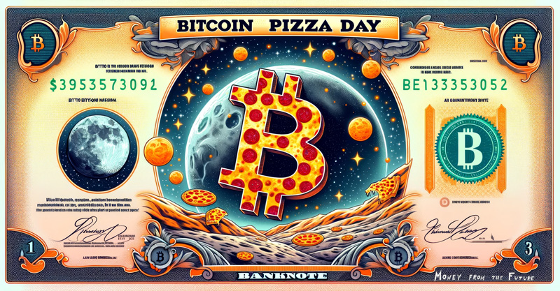
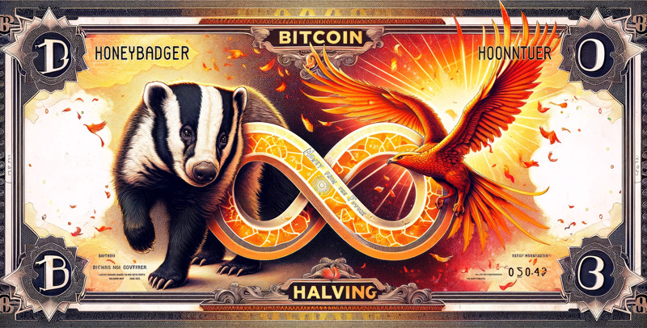
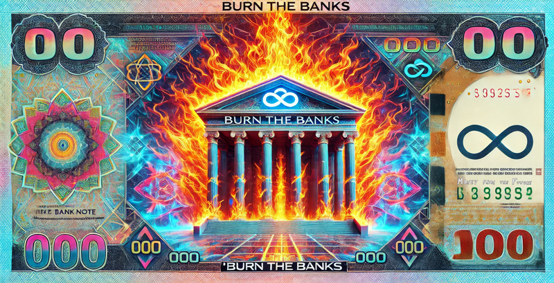
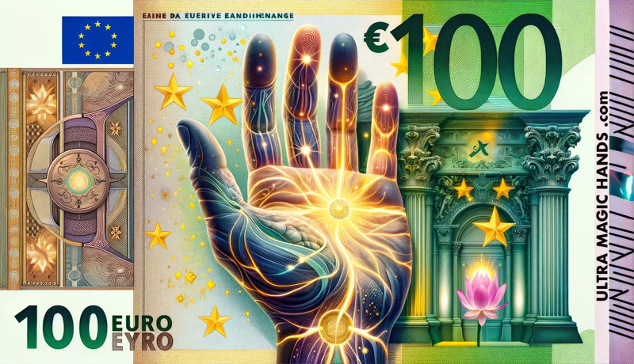

```
01 The Boss.jpg
02 Peace Planetary Council.jpg
03 Infinity.jpg
04 Poseidon.jpg
05 Pyramid.jpg
06 Berry pounds.jpg
07 2140.jpg
08 Super cyber genius.jpg
09 Astral Pirate.jpg
10 Amanita.jpg
11 Buddha Infinite Love.jpg
12 Flotilla.jpg
13 Immigration Climate.jpg
14 Cannabis.jpg
15 Palestine.jpg
16 Duality.jpg
17 One life.jpg
18 Kali.jpg
19 Love police.jpg
20 White Rabbit.jpg
21 Pizza.jpg
22 Halving.jpg
23 Burn banks.jpg
24 Ultra magic hands massage.jpg
```


### Note to self, future self, other self

Naming convention:
- `resized` (2000 px wide) around 1-2 MB
- `small` (800px wide) around 200 KB
- `unwatermarked` without signature

Then realised it is faster to introduce a new convention:
- `bg` (same as resized)
- `sm` (same as small)
- `-` dashes in the name because less hassle with adding spaces

Some files are not watermarked: the marketing / promo / advertisement is the integral part.

The order is not so random. Some thought were put into ordering the initial set of 24. Any further additions are likely be in chronological order.

### Socials

* https://www.instagram.com/moneyfromthefuture
* https://www.tiktok.com/@marsrobertson
